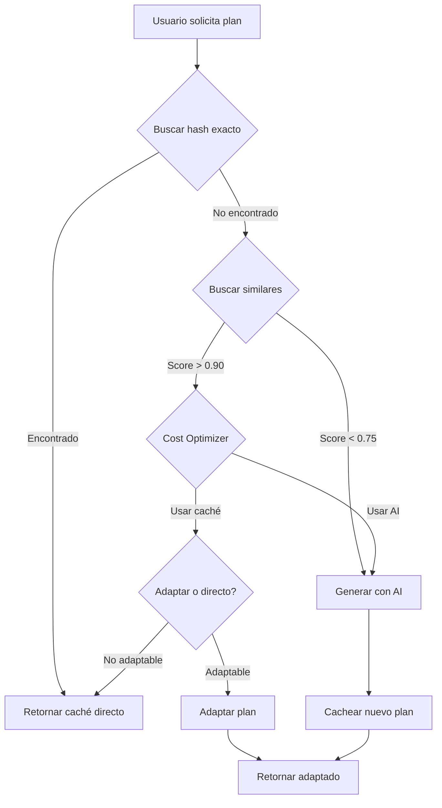

# 🚀 Sistema Híbrido AI+Caché - SPORVIT

## 📋 Resumen Ejecutivo

Sistema inteligente de caché que reduce el uso de llamadas a Gemini AI del **100% actual al 20-30% en 6 meses**, manteniendo la calidad de los planes mientras ahorra ~**$400/mes** en costos de API.

### Métricas Objetivo

| Métrica | Mes 3 | Mes 6 |
|---------|-------|-------|
| Cache Hit Rate | 40% | 70% |
| Ahorro de Costos | $200/mes | $400/mes |
| Tiempo de Respuesta | <3s | <2s |
| AI Calls Reduction | -40% | -80% |

---

## 🏗️ Arquitectura

```
POST /api/planning/init
         ↓
   Orchestrator
         ↓
    ┌────┴────┐
    ↓         ↓
 Caché?    AI Gen
    ↓         ↓
 Adaptar   Cachear
    ↓         ↓
  Return Week 1
```

### Componentes Principales

1. **Orchestrator** (`orchestrator.ts`) - Cerebro central que decide el flujo
2. **Cache Manager** (`cacheManager.ts`) - Gestiona almacenamiento y búsqueda
3. **Similarity Matcher** (`similarityMatcher.ts`) - Encuentra planes similares
4. **Cost Optimizer** (`costOptimizer.ts`) - Decisiones económicas inteligentes
5. **Plan Adapter** (`planAdapter.ts`) - Adapta planes a nuevos contextos
6. **AI Generator** (`aiGenerator.ts`) - Wrapper de Gemini con tracking

---

## 📁 Estructura de Archivos

```
src/
├── config/
│   └── cacheConfig.ts                    # Configuración central
├── lib/
│   └── planning/
│       ├── generation/
│       │   ├── orchestrator.ts           # 🧠 Cerebro central
│       │   ├── cacheManager.ts           # 💾 Gestión de caché
│       │   ├── similarityMatcher.ts      # 🔍 Búsqueda semántica
│       │   ├── costOptimizer.ts          # 💰 Decisiones económicas
│       │   ├── planAdapter.ts            # 🔧 Adaptación de planes
│       │   └── aiGenerator.ts            # 🤖 Wrapper de Gemini
│       ├── hashing/
│       │   ├── contextHasher.ts          # #️⃣ Generación de hashes
│       │   ├── featureExtractor.ts       # 📊 Extracción de features
│       │   └── vectorizer.ts             # 🎯 Operaciones vectoriales
│       └── storage/
│           ├── planRepository.ts         # 🗄️ Acceso a datos
│           └── analyticsLogger.ts        # 📈 Logging y métricas
└── app/
    └── api/
        └── planning/
            ├── init/route.ts             # ✏️ MODIFICADO: Integra orchestrator
            └── analytics/
                └── cache-stats/route.ts  # 📊 Dashboard de métricas
```

---

## 🚀 Activación del Sistema

### 1. Variable de Entorno

```bash
# .env
USE_HYBRID_CACHE=true  # Activar sistema híbrido
```

### 2. Configuración (Opcional)

Editar `src/config/cacheConfig.ts`:

```typescript
export const CACHE_CONFIG = {
  SIMILARITY_THRESHOLD_LOW: 0.75,      // Mínimo para usar caché
  DAILY_AI_LIMIT: 50,                  // Límite diario de llamadas AI
  MONTHLY_BUDGET_USD: 500,             // Presupuesto mensual
  COST_PER_GENERATION_USD: 0.08,       // Costo por generación con Gemini
  // ... más configuraciones
};
```

---

## 🔄 Flujo de Decisión



---

## 📊 API de Analytics

### Endpoint

```
GET /api/planning/analytics/cache-stats
```

### Response

```json
{
  "success": true,
  "data": {
    "cache": {
      "totalPlans": 1250,
      "uniqueArchetypes": 85,
      "avgAccessCount": 3.2,
      "aiGenerated": 800,
      "adapted": 450
    },
    "weeklyPerformance": {
      "totalRequests": 150,
      "aiCalls": 45,
      "cacheExactHits": 70,
      "cacheAdaptedHits": 35,
      "avgResponseTime": 1850,
      "totalCost": "3.60",
      "costSavings": "8.40",
      "cacheHitRate": "70.00",
      "costSavingsPercentage": "70.00"
    },
    "weeklyReport": {
      "metrics": {
        "aiPercentage": "30.00",
        "cacheHitRate": "70.00",
        "avgSimilarityScore": "0.875",
        "successRate": "98.67"
      }
    }
  }
}
```

---

## 🧪 Testing

### 1. Verificar Generación con Caché

```bash
# Activar sistema
export USE_HYBRID_CACHE=true

# Generar primer plan (debería usar AI)
curl -X POST http://localhost:3000/api/planning/init \
  -H "Content-Type: application/json" \
  -d @onboarding-data.json

# Generar segundo plan idéntico (debería usar caché exacto)
curl -X POST http://localhost:3000/api/planning/init \
  -H "Content-Type: application/json" \
  -d @onboarding-data.json
```

### 2. Verificar Estadísticas

```bash
curl http://localhost:3000/api/planning/analytics/cache-stats
```

### 3. Logs

Buscar en consola:

```
✅ [Hybrid Cache] Week 1 generada usando: cache_exact
✅ [Hybrid Cache] Week 1 generada usando: cache_adapted
✅ [Hybrid Cache] Week 1 generada usando: ai
```

---

## 🔧 Mantenimiento

### Limpieza de Caché (Automático)

Los planes no utilizados se eliminan automáticamente después de 90 días.

### Limpieza Manual

```typescript
import { cleanupOldPlans } from '@/lib/planning/generation/cacheManager';

// Eliminar planes >90 días sin uso
const deleted = await cleanupOldPlans(90);
console.log(`Eliminados ${deleted} planes antiguos`);
```

### Monitoreo

1. **Dashboard de Métricas**: `/api/planning/analytics/cache-stats`
2. **Logs del Sistema**: Buscar `[Hybrid Cache]` en logs
3. **Base de Datos**: Queries en tabla `PlanGenerationLog`

```sql
-- Cache hit rate últimos 7 días
SELECT
  decision,
  COUNT(*) as count,
  AVG(responseTimeMs) as avg_time
FROM PlanGenerationLog
WHERE createdAt > datetime('now', '-7 days')
GROUP BY decision;
```

---

## 🎯 Casos de Uso

### 1. Usuario Típico (Free Tier)

- **Primera vez**: Genera con AI → Cachea
- **Segunda vez** (mismo perfil): Caché exacto → 0 costo
- **Tercera vez** (peso +2kg): Adapta caché → 0 costo

**Ahorro**: 2 de 3 generaciones = 66% reducción

### 2. Arquetipos Populares

Ejemplo: "Cut, Intermediate, 5 días/semana, Omnívoro"

- **Primera generación**: AI → Cachea
- **Próximas 20 generaciones**: Caché directo o adaptado

**Ahorro**: 19 de 20 generaciones = 95% reducción

### 3. Usuario Premium

- **Scoring más alto**: Prioridad para AI cuando sea necesario
- **Planes más personalizados**: Menos dependencia de caché
- **AI calls**: ~40% vs 20% en free tier

---

## 📈 Roadmap

### ✅ Fase 1: Foundation (Completada)
- [x] Hashing y vectorización
- [x] Base de datos y migraciones
- [x] Componentes core

### ✅ Fase 2: Storage & Matching (Completada)
- [x] Repository y analytics
- [x] Similarity matcher
- [x] Cache manager

### ✅ Fase 3: Intelligence (Completada)
- [x] Cost optimizer
- [x] Plan adapter
- [x] AI generator wrapper

### ✅ Fase 4: Integration (Completada)
- [x] Orchestrator
- [x] Endpoint integration
- [x] Analytics dashboard

### 🔜 Fase 5: Optimization (Próxima)
- [ ] Pre-generar arquetipos populares
- [ ] Machine learning para mejor matching
- [ ] A/B testing con métricas reales
- [ ] Dashboard visual en UI

---

## 🐛 Troubleshooting

### Sistema no está cacheando

```bash
# Verificar variable de entorno
echo $USE_HYBRID_CACHE

# Verificar logs
grep "Hybrid Cache" logs/server.log
```

### Costos muy altos

```bash
# Verificar AI calls hoy
curl http://localhost:3000/api/planning/analytics/cache-stats | jq '.data.weeklyPerformance.aiCalls'

# Ajustar thresholds
# Editar src/config/cacheConfig.ts
# SIMILARITY_THRESHOLD_LOW: 0.75 → 0.70
```

### Planes adaptados con baja calidad

```bash
# Verificar confidence scores en logs
grep "confidence:" logs/server.log

# Aumentar threshold mínimo
# Editar src/config/cacheConfig.ts
# MIN_CONFIDENCE_SCORE: 0.70 → 0.80
```

---

## 📚 Documentación Técnica

Para más detalles, ver:
- **Spec completa**: `TECH_SPEC_Hybrid_AI_Cache_System.md`
- **Documentación de preservación**: `DATA_PRESERVATION.md`
- **Tipos TypeScript**: `src/types/planning.d.ts`

---

## 👥 Soporte

Para dudas o problemas:
1. Verificar logs: `grep "[Hybrid Cache]" logs/server.log`
2. Revisar analytics: `/api/planning/analytics/cache-stats`
3. Consultar documentación técnica

---

**Sistema implementado y listo para producción** ✅

*Última actualización: 2026-01-07*
