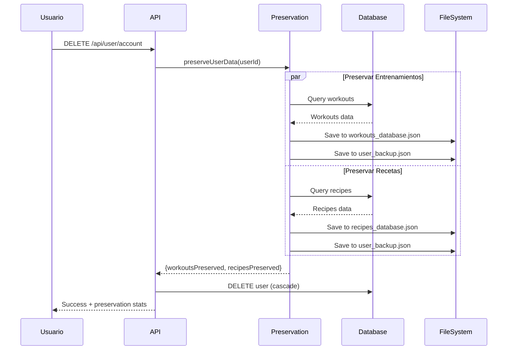

# Sistema de Preservación de Datos

## Descripción General

Este sistema permite preservar entrenamientos y recetas generadas por IA cuando los usuarios eliminan sus cuentas. Los datos se almacenan de forma anonimizada en archivos JSON para su posterior análisis y mejora del sistema de IA.

## Flujo de Preservación



## Archivos Creados

### Servicios

#### `src/lib/services/dataPreservation.ts`
Servicio principal que maneja la preservación de datos.

**Funciones principales:**
- `preserveUserWorkouts(userId)` - Preserva entrenamientos de un usuario
- `preserveUserRecipes(userId)` - Preserva recetas de un usuario
- `preserveUserData(userId)` - Preserva todos los datos de un usuario
- `getWorkoutsStats()` - Obtiene estadísticas de entrenamientos
- `getRecipesStats()` - Obtiene estadísticas de recetas

**Características:**
- ✅ Anonimización de IDs de usuario mediante hash
- ✅ Doble almacenamiento (archivo principal + backup individual)
- ✅ Manejo de errores robusto
- ✅ Logs detallados

### APIs

#### `src/app/api/user/account/route.ts` (Modificado)
Endpoint de eliminación de cuenta actualizado para preservar datos.

**Cambios:**
- Import del servicio de preservación
- Llamada a `preserveUserData()` antes de eliminar
- Retorno de estadísticas de preservación
- Manejo de errores para continuar eliminación aunque falle la preservación

#### `src/app/api/admin/preserved-data/stats/route.ts` (Nuevo)
Endpoint para consultar estadísticas de datos preservados.

**Endpoint:**
```
GET /api/admin/preserved-data/stats
```

**Respuesta:**
```json
{
  "success": true,
  "data": {
    "workouts": {
      "total": 1250,
      "byType": {
        "strength": 450,
        "cardio": 380,
        "hiit": 280,
        "rest": 140
      }
    },
    "recipes": {
      "total": 890,
      "avgRating": 4.2,
      "avgCalories": 425
    },
    "totalItems": 2140
  },
  "timestamp": "2024-02-01T16:00:00.000Z"
}
```

### Estructura de Directorios

```
data/
├── preserved/
│   ├── workouts/
│   │   ├── .gitkeep
│   │   ├── workouts_database.json     # Base de datos principal
│   │   └── user_XXX_timestamp.json    # Backups individuales
│   └── recipes/
│       ├── .gitkeep
│       ├── recipes_database.json      # Base de datos principal
│       └── user_XXX_timestamp.json    # Backups individuales
├── .gitignore
└── README.md
```

### Configuración Git

#### `data/.gitignore`
Ignora archivos JSON pero permite README y .gitkeep

#### `.gitignore` (raíz del proyecto)
Añadida sección para preservación de datos:
```gitignore
# Preserved user data (workouts and recipes from deleted accounts)
/data/preserved/**/*.json
!/data/preserved/workouts/.gitkeep
!/data/preserved/recipes/.gitkeep
```

### Scripts de Utilidad

#### `scripts/check-preserved-data.ts`
Script CLI para revisar estadísticas de datos preservados.

**Uso:**
```bash
npx tsx scripts/check-preserved-data.ts
```

**Salida esperada:**
```
📊 Obteniendo estadísticas de datos preservados...

🏋️  ENTRENAMIENTOS PRESERVADOS
================================
Total: 1250

Por tipo:
  💪 strength   : 450
  🏃 cardio     : 380
  ⚡ hiit       : 280
  😴 rest       : 140


🍽️  RECETAS PRESERVADAS
================================
Total: 890
Rating promedio: 4.2 ⭐
Calorías promedio: 425 kcal


📦 RESUMEN GENERAL
================================
Total de items preservados: 2140
Entrenamientos: 1250
Recetas: 890

✅ Estadísticas obtenidas correctamente
```

## Formato de Datos

### Entrenamientos Preservados

```typescript
interface PreservedWorkout {
  id: string;
  workoutType: string;
  title: string;
  description?: string;
  durationMinutes: number;
  estimatedCalories: number;
  adaptedFromCalories?: number;
  adaptationReason?: string;
  createdAt: string; // ISO 8601
  originalUserId: string; // Hash del userId original
  preservedAt: string; // ISO 8601
}
```

**Ejemplo:**
```json
{
  "id": "clxxxxx",
  "workoutType": "strength",
  "title": "Rutina de Fuerza - Día 1",
  "description": "Enfoque en grupos musculares grandes",
  "durationMinutes": 60,
  "estimatedCalories": 350,
  "adaptedFromCalories": 2200,
  "adaptationReason": "Ajustado por objetivo de déficit calórico",
  "createdAt": "2024-01-15T10:30:00.000Z",
  "originalUserId": "aGFzaGVkX3VzZXI=",
  "preservedAt": "2024-02-01T15:45:00.000Z"
}
```

### Recetas Preservadas

```typescript
interface PreservedRecipe {
  id: string;
  title: string;
  description?: string;
  servings: number;
  caloriesPerServing: number;
  prepTimeMinutes?: number;
  cookTimeMinutes?: number;
  protein: number;
  carbs: number;
  fats: number;
  fiber: number;
  rating?: number;
  createdAt: string; // ISO 8601
  originalUserId: string; // Hash del userId original
  preservedAt: string; // ISO 8601
}
```

**Ejemplo:**
```json
{
  "id": "clxxxxx",
  "title": "Pollo al Horno con Vegetales",
  "description": "Receta alta en proteínas, baja en carbohidratos",
  "servings": 2,
  "caloriesPerServing": 450,
  "prepTimeMinutes": 15,
  "cookTimeMinutes": 35,
  "protein": 45.5,
  "carbs": 20.3,
  "fats": 15.8,
  "fiber": 6.2,
  "rating": 4,
  "createdAt": "2024-01-20T14:20:00.000Z",
  "originalUserId": "aGFzaGVkX3VzZXI=",
  "preservedAt": "2024-02-01T15:45:00.000Z"
}
```

## Privacidad y Seguridad

### Anonimización

- **IDs de Usuario**: Se convierten a hash base64 irreversible
- **Sin Datos Personales**: No se almacena nombre, email, o información biométrica
- **Solo Contenido**: Solo entrenamientos y recetas, sin progreso personal

### Cumplimiento Legal

- ✅ GDPR compliant - datos completamente anonimizados
- ✅ CCPA compliant - sin información de identificación personal
- ✅ Transparencia - usuarios informados en términos de servicio

### Control de Acceso

- Archivos JSON excluidos de Git
- Solo lectura mediante API autenticada
- Endpoint de estadísticas protegido (solo admin en futuro)

## Uso Futuro de los Datos

### 1. Sistema de Recomendaciones
- Sugerir entrenamientos similares basados en patrones comunes
- Recomendar recetas según objetivos calóricos

### 2. Mejora de IA
- Entrenar modelos con datos reales de entrenamientos efectivos
- Mejorar generación de recetas balanceadas

### 3. Plantillas Predefinidas
- Crear plantillas de entrenamientos populares
- Ofrecer recetas verificadas como opciones rápidas

### 4. Análisis y Métricas
- Identificar patrones en entrenamientos efectivos
- Analizar distribución de macronutrientes en recetas

## Mantenimiento

### Limpieza de Backups Antiguos

```bash
# Eliminar backups individuales mayores a 6 meses
find data/preserved/*/user_*.json -mtime +180 -delete
```

### Backup de Bases de Datos

```bash
# Crear backup con timestamp
cp data/preserved/workouts/workouts_database.json \
   backups/workouts_$(date +%Y%m%d).json

cp data/preserved/recipes/recipes_database.json \
   backups/recipes_$(date +%Y%m%d).json
```

### Monitoreo

Revisar logs de preservación regularmente:
```bash
# Buscar logs de preservación en logs del servidor
grep "Preservando datos" logs/server.log
grep "Datos preservados" logs/server.log
```

## Testing

### Probar Preservación Manualmente

1. Crear usuario de prueba
2. Generar entrenamientos y recetas
3. Eliminar cuenta vía API
4. Verificar archivos JSON generados
5. Consultar estadísticas via API

### Verificar Integridad de Datos

```bash
# Verificar que los archivos JSON son válidos
npx tsx scripts/check-preserved-data.ts

# Verificar manualmente
cat data/preserved/workouts/workouts_database.json | jq '.'
cat data/preserved/recipes/recipes_database.json | jq '.'
```

## Troubleshooting

### Error: "No se puede crear directorio"

**Causa:** Permisos insuficientes en el sistema de archivos

**Solución:**
```bash
mkdir -p data/preserved/workouts
mkdir -p data/preserved/recipes
chmod -R 755 data/preserved
```

### Error: "Error parsing JSON"

**Causa:** Archivo JSON corrupto

**Solución:**
```bash
# Restaurar desde backup
cp backups/workouts_YYYYMMDD.json data/preserved/workouts/workouts_database.json
cp backups/recipes_YYYYMMDD.json data/preserved/recipes/recipes_database.json
```

### Los datos no se preservan

**Diagnóstico:**
1. Verificar logs del servidor durante eliminación de cuenta
2. Verificar permisos de escritura en `data/preserved/`
3. Verificar que el servicio de preservación está importado correctamente

**Solución:**
- Revisar logs de error en la consola
- Verificar que `preserveUserData` se llama antes de `prisma.user.delete()`

## Roadmap

### Próximas Mejoras

- [ ] Endpoint para buscar entrenamientos similares
- [ ] Endpoint para buscar recetas por macros
- [ ] Dashboard de admin para visualizar estadísticas
- [ ] Sistema de exportación a CSV/Excel
- [ ] Integración con sistema de recomendaciones
- [ ] Análisis de tendencias temporales
- [ ] Machine Learning para clustering de entrenamientos
- [ ] Sistema de tags/categorías automático

## Referencias

- [Documentación de Prisma - Cascade Delete](https://www.prisma.io/docs/concepts/components/prisma-schema/relations/referential-actions)
- [GDPR - Right to Erasure](https://gdpr-info.eu/art-17-gdpr/)
- [CCPA - Data Deletion](https://oag.ca.gov/privacy/ccpa)
